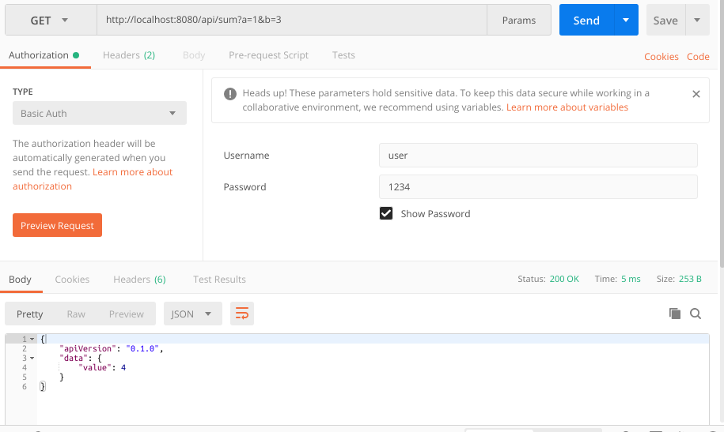

<p align="center">
  
</p>

## Example about running an action through the auth support 
Running example:
```
git clone https://github.com/meboHQ/example-auth.git
cd example-auth
npm install
NODE_ENV=development node .
```

## Requirements
- Node 8 or greater
- Express 4 or greater

## Action
Authentication using basic-auth strategy
`GET: http://localhost:8080/api/sum?a=1&b=2`


*running on [postman](https://www.getpostman.com)*

## Licensing
Mebo is free software; you can redistribute it and/or modify it under the terms of the MIT License
